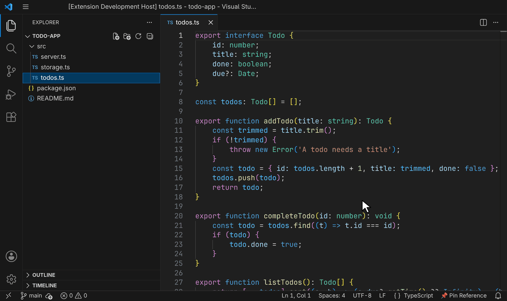
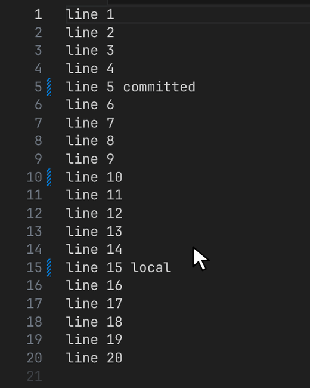

# Git Pinned Diff

Pin a branch, tag or commit and see everything that changed since then, right in your editor.

## Features

- **Pin from the status bar**: search branches, tags and recent commits, or type any ref such as `HEAD~2`.
- **Native change bars** in the gutter, so breakpoints still work on every line.
- **Click a change bar** to see its diff against the pinned ref.
- **Changed files list** in the Source Control view; click a file to open its diff.
- **Follows along** as you type, commit or fetch.
- **Every repository**: multi-root workspaces, nested repositories, worktrees and submodules.
- **Quiet**: nothing is highlighted until you pin a ref.

## Requirements

- VS Code 1.90 or later, with the built-in Git extension enabled.

## Known Issues

- **Git's own change bars share the gutter and look the same.** To see only pinned changes, right-click a line number, open **Diff Decorations** and turn off **Git Local Changes (Working Tree)**. Turn it back on after unpinning.

  

- The pinned ref resets when the window reloads.
- One pinned ref applies to the whole workspace.
- Files renamed since the ref show as entirely new in the gutter.

Report issues on [GitHub](https://github.com/mashurr/git-pinned-commit-highlighter/issues).

## Release Notes

See [CHANGELOG.md](CHANGELOG.md).
